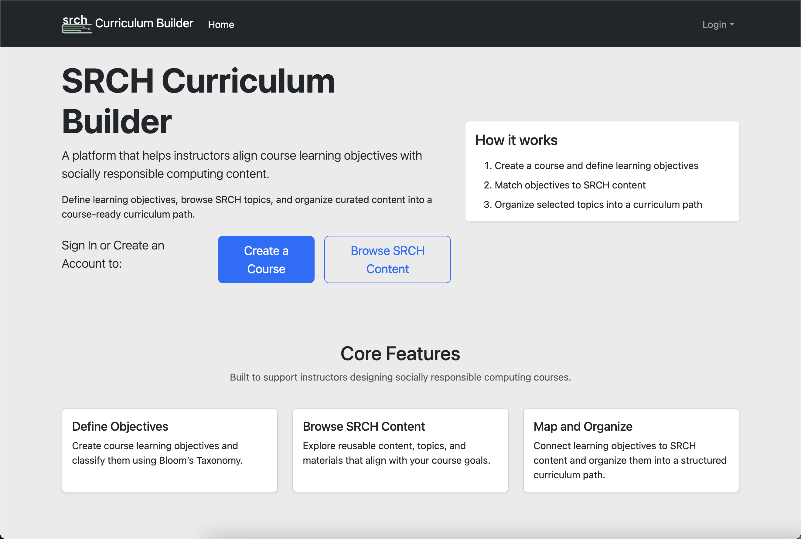
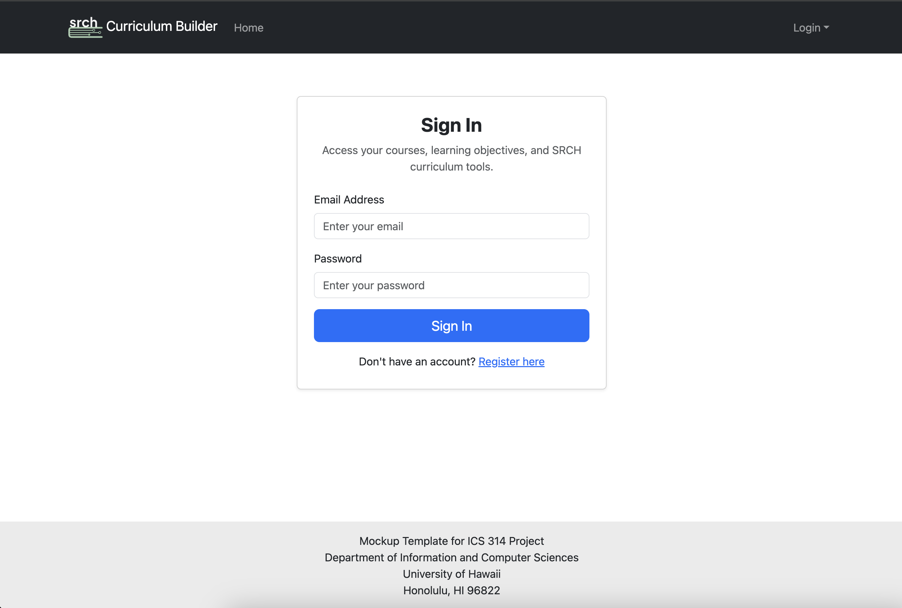
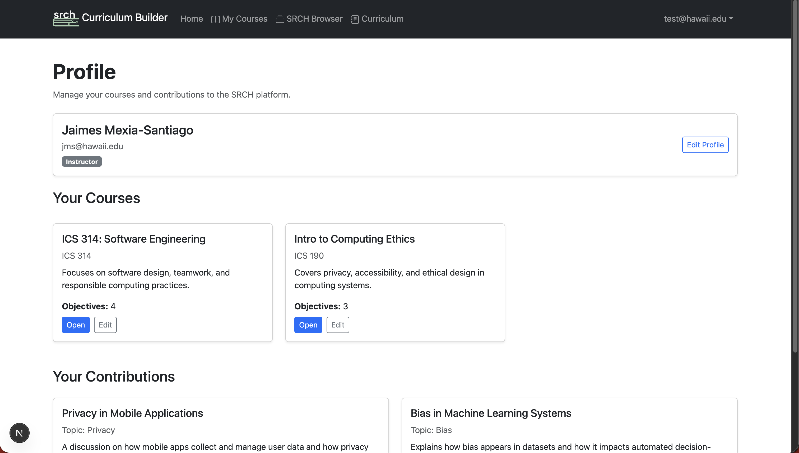
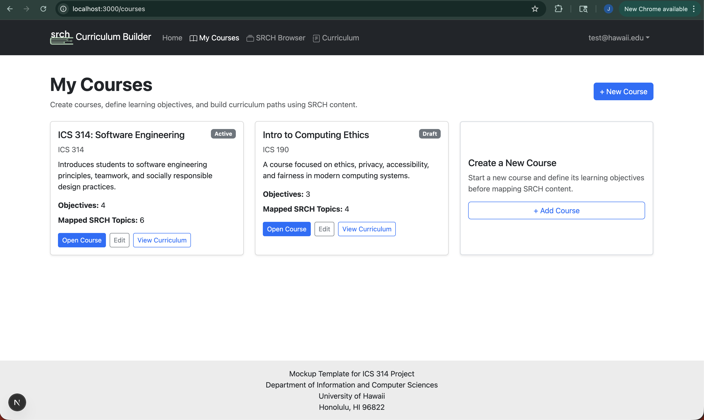
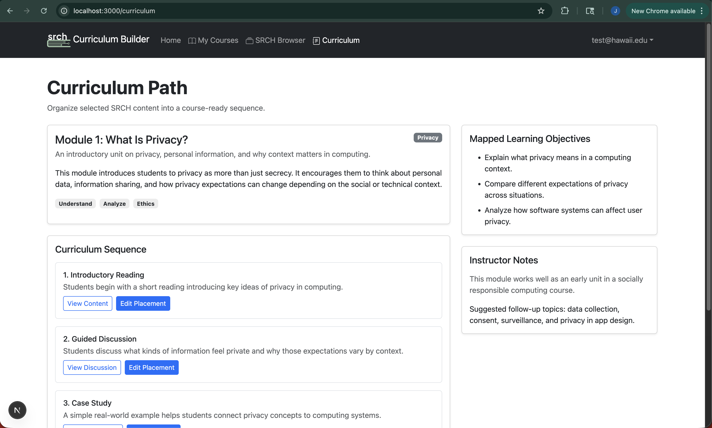

# Manoa SRCH Curriculum Builder
<a href="https://docs.google.com/document/d/18CNi7wyIuc5msmWvYp0cfrgZYB2pT_O6dbEzotG73iE/edit?tab=t.0">
  Team Contract Document
</a>

## Table of contents

* [Overview](#overview)
* [Approach](#approach)
* [Community Feedback](#community-feedback)
* [Use Cases](#use-cases)
* [Example enhancements](#example-enhancements)
* [Conclusion](#conclusion)
* [Team](#team)

## Aligning Objectives With Safety: SRCH Navigator Proposal

Modern computer science and engineering education continually changes and evolves, especially in areas such as socially responsible computing. However, while information on these topics continues to grow and develop, it is often fragmented, incomplete, or not clearly explained to the end user. Additionally, it becomes more and more difficult for instructors in this field to align their courses with these ever-changing subjects. This project proposes a system that bridges the gap between what instructors want students to learn and the content available to teach it.

*Problem:*

The Socially Responsible Computing Handbook (SRCH) is an evolving collection of content intended to support instructors. However, it is not designed as a traditional textbook for a single course. Instead, it is a resource where instructors are expected to select relevant material and apply it to their own courses, which proposes several challenges:

• Some content is too advanced or not aligned with a course’s learning objectives

• The SRCH is incomplete and continuously evolving

• There is no structured way to map course objectives to relevant material

• Instructors must manually curate content, leading to inconsistency and inefficiency

• There is no standardized workflow for sharing curated curriculum paths

Essentially, instructors are given a large resource, but without the tools to effectively organize and align it to their teaching goals.

*Solution:*

This project proposes a web application that allows instructors to:

• Define their own courses, categorized using Bloom’s Taxonomy

• Browse and search SRCH content

• Map course learning objectives to relevant SRCH material

• Contribute new material and share curated content with others

This system will serve as a tool to not only align curriculum with the SRCH subjects, but to allow instructors to help develop a platform that uses the SRCH as its basis. This application is designed specifically for instructors at the University of Hawai‘i at Mānoa, particularly those teaching ICS courses such as ICS 314, where integrating socially responsible computing topics into technical material is increasingly important.

## Approach
<!-- Expand the section below -->

SRCH Curriculum Builder has two user roles: instructors and administrators. Instructors are able to browsw and view SRCH curriculum currently available, and use the relevant topics to build out their course, and tie it into responsible computer practices. Administrators will be able to manage content posted by Instructors, and review posted content for relevance.

<!-- Expand the section above -->

### Mockup Implementations

To support the development of the platform, the application will use several key pages:

*Home Page:* A landing page introducing the platform and its purpose, along with quick access to login or course dashboards.

*Login/Register:* An authentication system allowing instructors and editors to access their data and contributions.

*User Profile Page:* Displays user information, courses created and contributed content.

*Course Management (CRUD):* Allows instructors to:

• Create, edit, and delete courses 

• Provide descriptions and metadata 

• Manage course-specific learning objectives

*SRCH Content Browser:* Allows instructors to:

• Viewing SRCH topics

• Filtering by topic, difficulty, or relevance

• Selecting content for potential inclusion

## Community Feedback

We are interested in your experience using SRCH Curriculum Builder!  If you would like, please take a couple of minutes to fill out the [SRCH Curriculum Builder Feedback Form](#). <!-- need to build form later -->

## Use Cases

As this system is designed to support realistic instructor workflows, the usual use cases include:

**Course Creation and Alignment**

An instructor creates a new course and defines several learning objectives, such as:

• “Understand ethical implications of AI systems”

• “Understanding design processes behind accessibility”

Each objective will be categorized using Bloom’s Taxonomy.

The instructor then browses the SRCH and identifies relevant topics. As they explore, they attach content to specific learning objectives, forming a structured mapping between goals and materials.

**Curriculum Structuring**

After selecting the relevant topics from the SRCH, the instructor is able to organize it and create a representation of how students will learn those topics from a given course material.

**Content Contribution**

Because the SRCH is actively being developed, there are many gaps in the information. An instructor would be able to identify this need and:

• Create new content

• Add explanations and case studies

• Include appropriate learning objectives and references used from their courses

## Example enhancements

While the initial proposal focuses on core functionality, there are several ways the scope could be expanded:

**Analytics Dashboard**

Track how often content is used, which objectives are most common, and where gaps exist.

**Integration with Learning Platforms**

Since platforms like Lamaku already use Bloom’s Taxonomy, this system could integrate directly with assignment creation tools. Additionally, integration with Zotero or other like systems into the search functionality will assist with expanding the knowledge base and decreasing any gaps.

Future versions could include synchronization with an external SRCH database, allowing content to be updated dynamically while preserving instructor-specific mappings.

**Collaborative Curriculum Design**

Allow for the ability to share information between instructors, allowing for one to implement course alignments and mappings already integrated with the SRCH (acting like a similar functionality of sharing a repository structure in GitHub).

## Conclusion

This project addresses a real challenge in modern computing education: aligning new content with structured learning goals. By combining the wider knowledge data pool with the tools proposed into a single platform, this system has the potential to significantly improve how instructors engage with educational resources. Rather than forcing instructors to adapt content found elsewhere into their courses, this tool helps them to shape content around their objectives.

## Team

BowFolios is designed, implemented, and maintained by [Jaimes Mexia-Santiago](https://jmexias.github.io/), [Ahnasia Goulbourne](https://ahnasiakg2234.github.io/), and [Zackary Lown](https://zacklown.github.io/).

## M1 Project Page Completions
[M1](https://github.com/orgs/manoa-srch/projects/1/views/2)

## M2 Project Page
[M2](https://github.com/orgs/manoa-srch/projects/6)

## Deployment
[Manoa SRCH](https://srch-application-project-eight.vercel.app/)

## In-Progress Implementations to come:
* [Deployment](#deployment) 
* [User Guide](#user-guide)
* [Community Feedback](#community-feedback)
* [Developer Guide](#developer-guide)
* [Development History](#development-history)
* [Example enhancements](#example-enhancements)
* [Team](#team)
